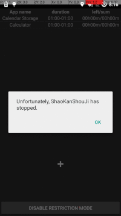

# Need to fix


```
04-07 20:16:42.172 15677-15902/com.shaokanshouji.zwj.shaokanshouji E/AndroidRuntime: FATAL EXCEPTION: IntentService[MonitorService]
    Process: com.shaokanshouji.zwj.shaokanshouji, PID: 15677
    android.util.AndroidRuntimeException: Calling startActivity() from outside of an Activity  context requires the FLAG_ACTIVITY_NEW_TASK flag. Is this really what you want?
        at android.app.ContextImpl.startActivity(ContextImpl.java:1271)
        at android.app.ContextImpl.startActivity(ContextImpl.java:1258)
        at android.content.ContextWrapper.startActivity(ContextWrapper.java:329)
        at com.shaokanshouji.zwj.App.MonitorService.onHandleIntent(MonitorService.java:45)
        at android.app.IntentService$ServiceHandler.handleMessage(IntentService.java:65)
        at android.os.Handler.dispatchMessage(Handler.java:102)
        at android.os.Looper.loop(Looper.java:135)
        at android.os.HandlerThread.run(HandlerThread.java:61)

```

- Is this really needed?

```
<uses-permission android:name="android.permission.PACKAGE_USAGE_STATS" />
```